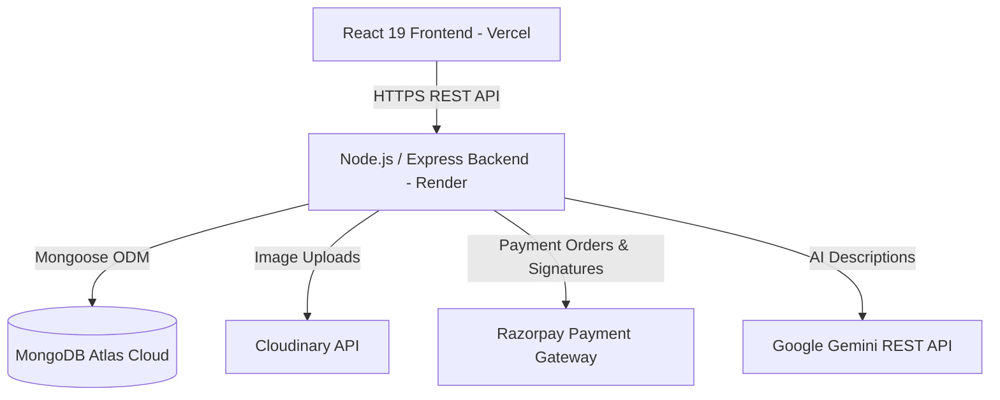

# Architecture Documentation

## System Topology & Flow

## Security & Token Lifecycle

1. **Authentication State**:
   - `Access Token`: 15-minute expiration, returned in API payload, stored exclusively in Redux memory (`authSlice.js`).
   - `Refresh Token`: 7-day expiration, stored in MongoDB `User.refreshToken` and sent as an `HttpOnly`, `SameSite=None`, `Secure` cookie.
2. **Token Rotation**:
   - Every request to `POST /api/v1/auth/refresh-token` validates the stored token, rotates both access and refresh tokens, updates MongoDB, and replaces the cookie.
3. **Role-Based Authorization**:
   - `verifyToken` middleware populates `req.user`.
   - `requireRole('admin')` or `requireRole('seller', 'admin')` verifies role server-side.

## Payment & Multi-Vendor Order Lifecycle

1. **Cart Checkout**:
   - Client requests `POST /payments/create-order`.
   - Server reloads cart items from MongoDB and calculates exact `subtotal` and `totalAmount`.
   - Server initializes Razorpay order and returns `razorpayOrderId`.
2. **Payment Verification**:
   - Client completes payment and sends `razorpay_order_id`, `razorpay_payment_id`, `razorpay_signature`, and `shippingAddressId` to `POST /payments/verify`.
   - Server verifies HMAC SHA256 signature using `RAZORPAY_KEY_SECRET`.
   - Server checks idempotency (`Order.findOne({ razorpayPaymentId })`).
   - Server atomically decrements product stock using `{ stock: { $gte: item.quantity } }`.
   - Server creates `Order` document and clears `Cart`.
